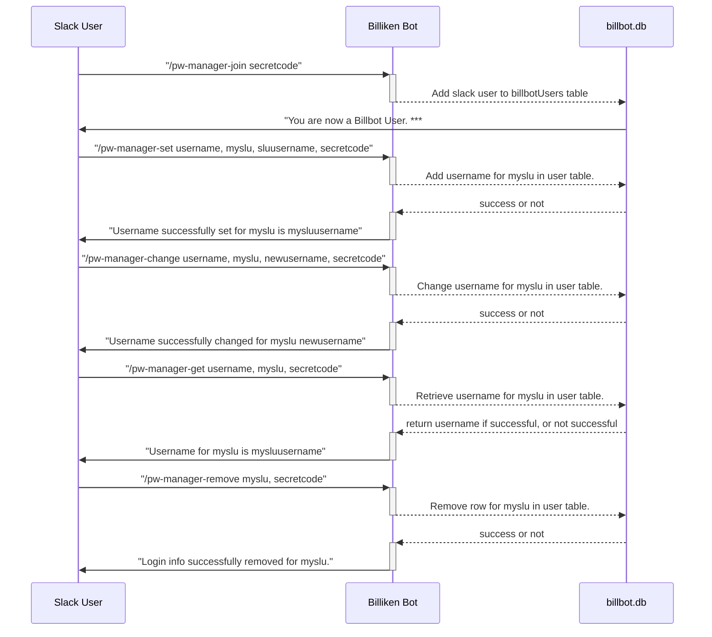

```mermaid
sequenceDiagram
    Slack User->>+Billiken Bot: "/pw-manager-join secretcode"
    Billiken Bot-->>-billbot.db: Add slack user to billbotUsers table
    billbot.db->>Slack User: "You are now a Billbot User. ***
    
    Slack User->>+Billiken Bot: "/pw-manager-set username, myslu, sluusername, secretcode"
    Billiken Bot-->>-billbot.db: Add username for myslu in user table.
    billbot.db-->>+Billiken Bot: success or not
    Billiken Bot->>-Slack User: "Username successfully set for myslu is mysluusername"

    Slack User->>+Billiken Bot: "/pw-manager-change username, myslu, newusername, secretcode"
    Billiken Bot-->>-billbot.db: Change username for myslu in user table.
    billbot.db-->>+Billiken Bot: success or not
    Billiken Bot->>-Slack User: "Username successfully changed for myslu newusername"

    Slack User->>+Billiken Bot: "/pw-manager-get username, myslu, secretcode"
    Billiken Bot-->>-billbot.db: Retrieve username for myslu in user table.
    billbot.db-->>+Billiken Bot: return username if successful, or not successful
    Billiken Bot->>-Slack User: "Username for myslu is mysluusername"

    Slack User->>+Billiken Bot: "/pw-manager-remove myslu, secretcode"
    Billiken Bot-->>-billbot.db: Remove row for myslu in user table.
    billbot.db-->>+Billiken Bot: success or not
    Billiken Bot->>-Slack User: "Login info successfully removed for myslu."
```
