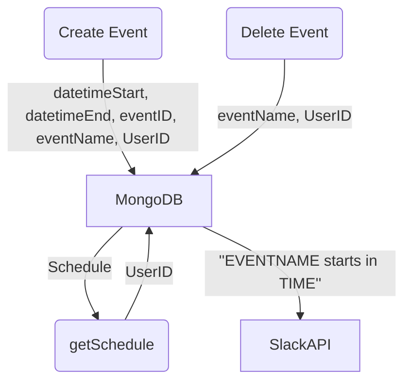

```mermaid
graph TD;
    A(Create Event)-->|datetimeStart, datetimeEnd, eventID, eventName, UserID|B[MongoDB]
    C(Delete Event)-->|eventName, UserID|B
    D(getSchedule)-->|UserID|B
    B-->|Schedule|D
    B-->|''EVENTNAME starts in TIME''|E[SlackAPI]
```