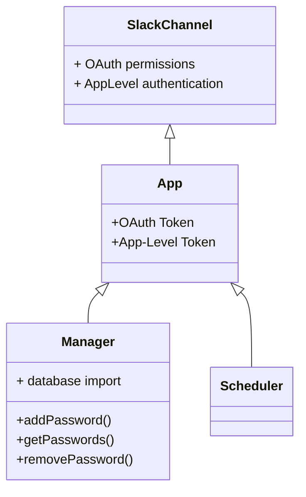

```mermaid
classDiagram
    App <|-- Manager
    App <|-- Scheduler
    SlackChannel <|-- App
    App : +OAuth Token
    App : +App-Level Token
    class Manager{
        + database import
        +addPassword()
        +getPasswords()
        +removePassword()
    }
    class SlackChannel{
        + OAuth permissions
        + AppLevel authentication
    }
```
