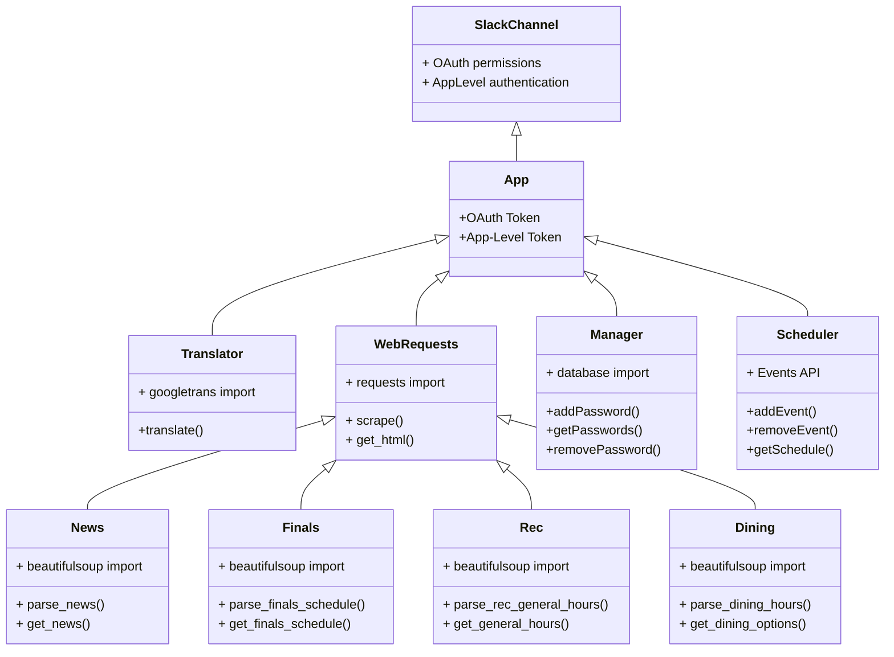

```mermaid
classDiagram
    App <|-- Translator
    App <|-- WebRequests
    App <|-- Manager
    App <|-- Scheduler
    SlackChannel <|-- App
    WebRequests <|-- News
    WebRequests <|-- Finals
    WebRequests <|-- Rec
    WebRequests <|-- Dining
    App : +OAuth Token
    App : +App-Level Token
    class Translator{
        + googletrans import
        +translate()
    }
    class WebRequests{
        + requests import
        + scrape()
        + get_html()
    }
    class Manager{
        + database import
        +addPassword()
        +getPasswords()
        +removePassword()
    }
    class Scheduler{
        + Events API
        +addEvent()
        +removeEvent()
        +getSchedule()
    }
    class SlackChannel{
        + OAuth permissions
        + AppLevel authentication
    }
    class News{
        + beautifulsoup import
        + parse_news()
        + get_news()
    }
    class Finals{
        + beautifulsoup import
        + parse_finals_schedule()
        + get_finals_schedule()
    }
    class Rec{
        + beautifulsoup import
        + parse_rec_general_hours()
        + get_general_hours()
    }
    class Dining{
        + beautifulsoup import
        + parse_dining_hours()
        + get_dining_options()
    }
```
